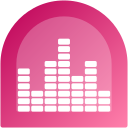

# Audiothek
Audiothek is an unoffical ARD Audiothek Content Viewer for Sailfish OS.

I am not the publisher or creator of the content used in this app. 
The copyright belongs to [ARD Audiothek](https://www.ardaudiothek.de/)!

>

## Current state of development
I started this project just for fun. It is more or less in an alpha state. During development the API of Audiothek changed. There seems to be a transition of the offical app to a GraphQL implementation. Let's hope that the old API will not be switched off! 

## Features
- Browse content
- Listen to podcasts
- Resume last played
- Search for content
- Personal favorites management

## Planned Features
- Download content for offline mode
- Create playlists
- Switch to undocumented GraphQL API (if possible)
- Feature requests

## Intention of this project

This app is part of my plan to replace all android apps I use with native ones. If they don't exist, I will try to create one.

## Social Media

Follow this project on [Mastodon](https://social.nubecula.org/@audiothek)

## Donations

If you like my work, you can buy me a beer! 

